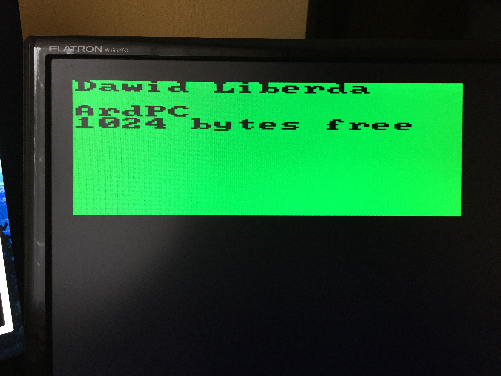
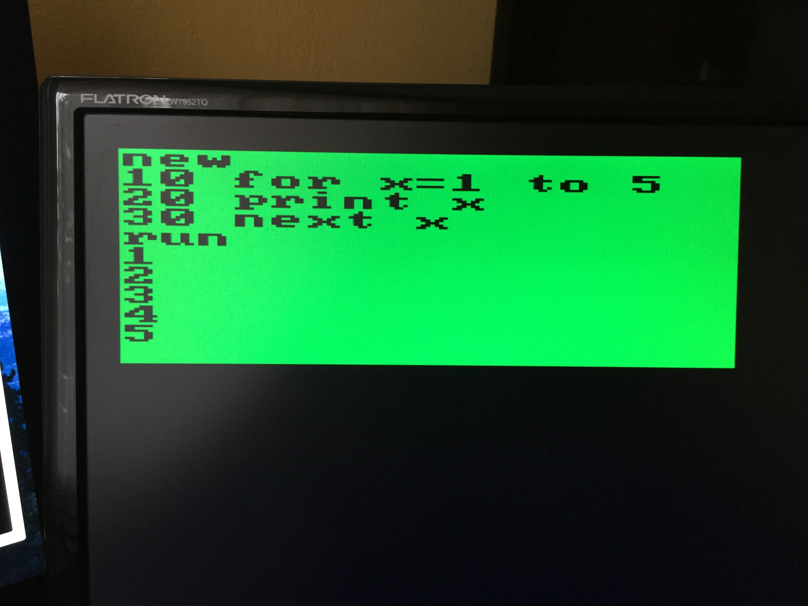
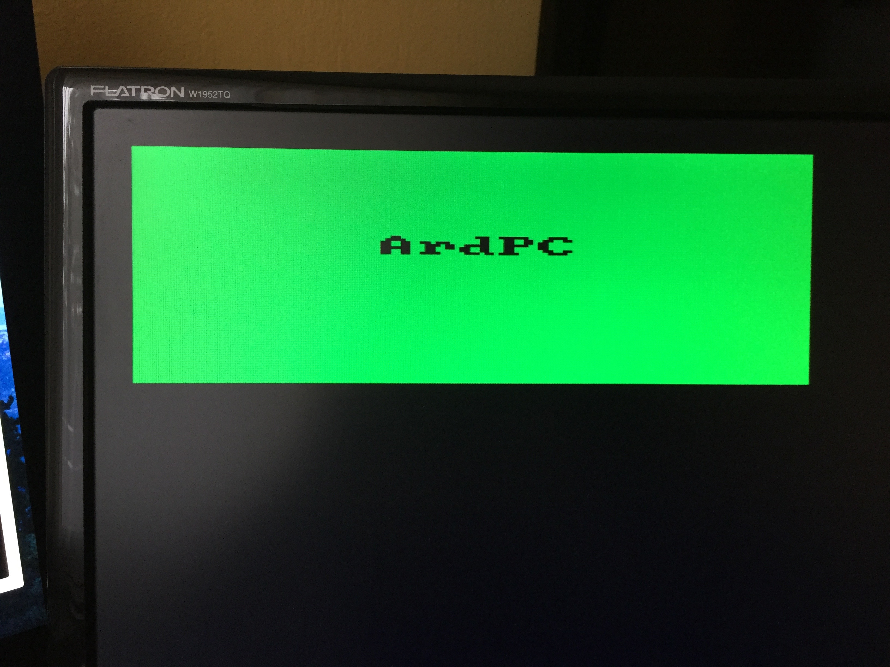
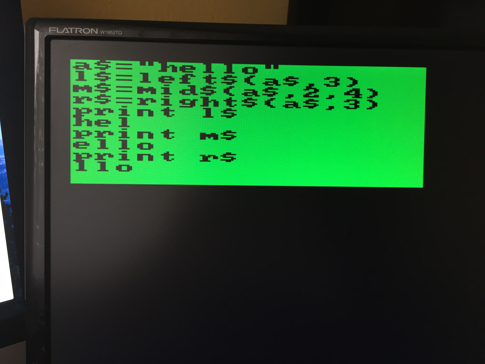
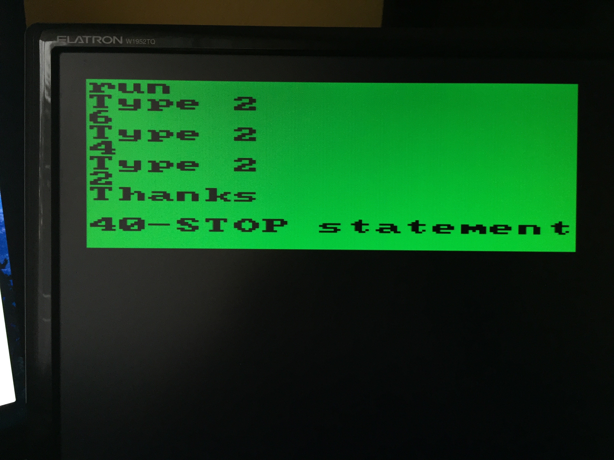
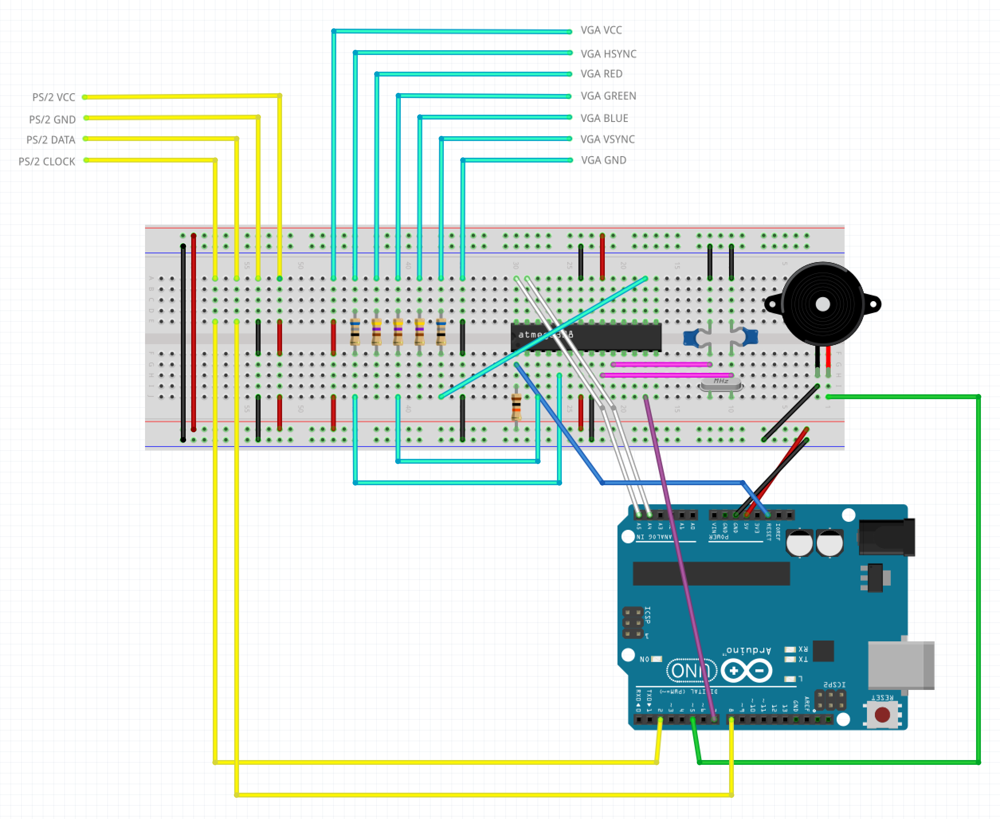
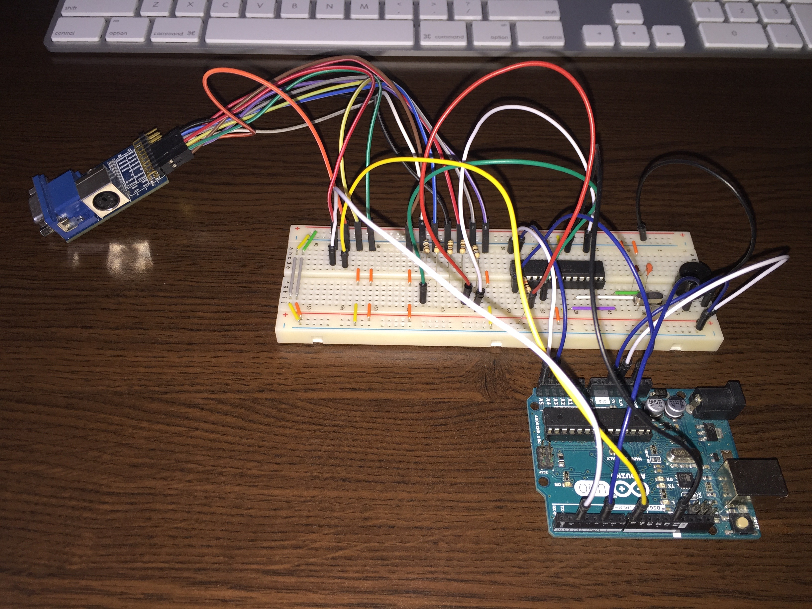
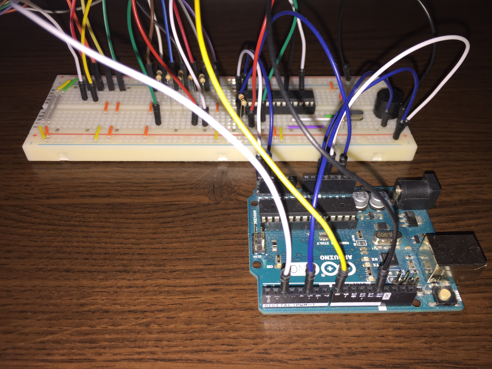
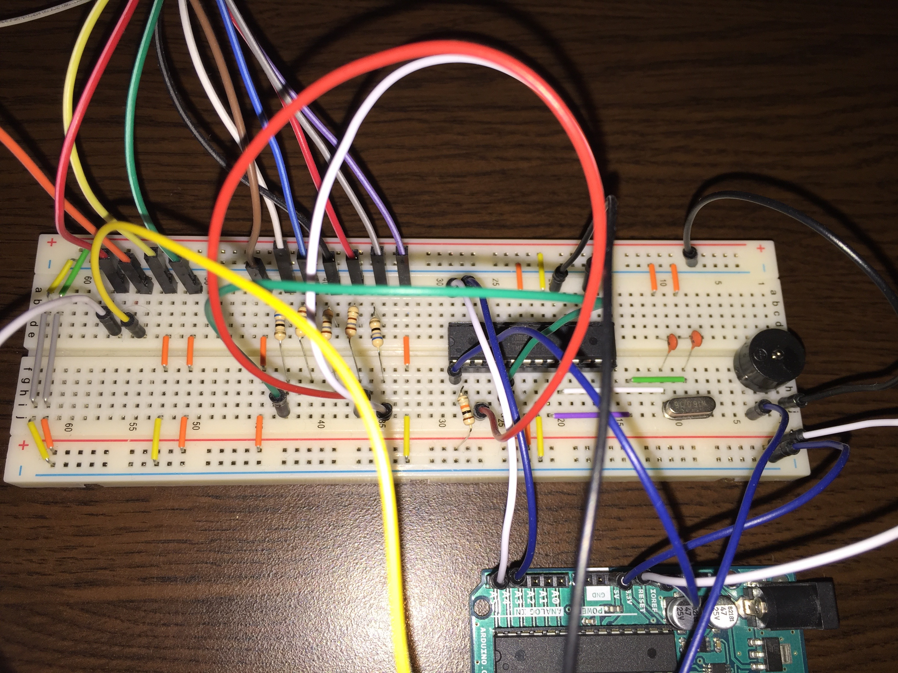
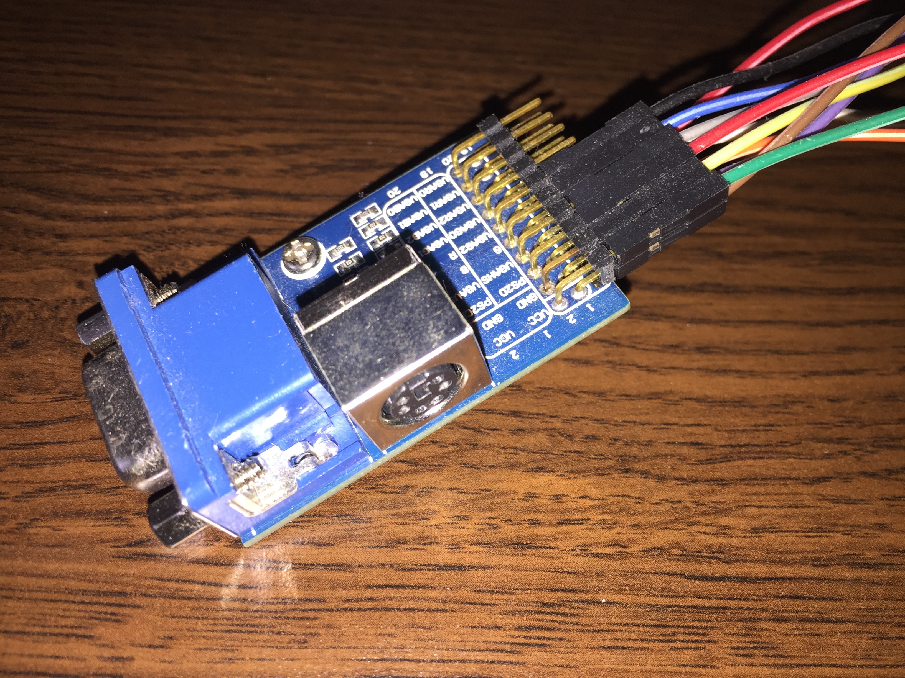

# ArdPC - Arduino Personal Computer

ArdPC is an 8-bit microcomputer based on Arduino Uno with an additional ATmega328 micro-controller, the purpose of which is to generate a video signal. The computer includes BASIC language intepreter and it has two ports - VGA and PS/2. User has access to 1 kB SRAM memory. Complete programs can be stored in the non-volatile EEPROM memory.

Size of RAM memory and clock speed of ATmega328 allows to generate text mode with 17x11 characters.

Piezoelectric buzzer is connected for keyboard clicks and other sounds.

<h2>Credits</h2>

<a href="https://github.com/robinhedwards/ArduinoBASIC">BASIC interpreter</a> by Robin Edwards  
<a href="http://www.gammon.com.au/forum/?id=11608">VGA color video generation</a> by Nick Gammon  
Thanks to Sandro Maffiodo for help in understanding video generation in his <a href="https://github.com/smaffer/vgax">VGAX library</a>.

<h2>BASIC Interpreter</h2>

Variables names can be up to 8 alphanumeric characters, but they must start with a letter. 
String variable names must end in $. 

Variable DAVE16 is the same as dave16. Also command print is the same as PRINT.  

<table>
  <tr align="center">
    <td width="200px"><b> Command </b></td>
    <td><b> Description </b></td>
    <td width="200px"><b> Example </b></td>
  </tr>
  <tr align="center">
    <td> PRINT &lt;expr&gt;;&lt;expr&gt; </td>
    <td> Outputs text or variable </td>
    <td>
      PRINT "A=";a  
      PRINT a
    </td>
  </tr>
  <tr align="center">
    <td> LET variable = &lt;expr&gt; </td>
    <td> Assigns numerical value or string in variable </td>
    <td>
      LET a = 5  
      LET a$ = "hello"
    </td>
  </tr>
  <tr align="center">
    <td> LIST [start],[end] </td>
    <td> Displays the BASIC program currently in memory </td>
    <td>
      LIST  
      LIST 10,100
    </td>
  </tr>
  <tr align="center">
    <td> RUN [lineNumber] </td>
    <td> Starts a BASIC program </td>
    <td>
      RUN  
      RUN 10
    </td>
  </tr>
  <tr align="center">
    <td> GOTO [lineNumber] </td>
    <td> Jumps to the indicated line and the execution of the BASIC program is continued at that line </td>
    <td> GOTO 10 </td>
  </tr>
  <tr align="center">
    <td> REM &lt;comment&gt; </td>
    <td> Places remark into BASIC program </td>
    <td> REM ** ArdPC ** </td>
  </tr>
  <tr align="center">
    <td> STOP </td>
    <td> Breaks a BASIC program </td>
    <td> STOP </td>
  </tr>
  <tr align="center">
    <td> CONT </td>
    <td> Resumes a BASIC program </td>
    <td> CONT </td>
  </tr>
  <tr align="center">
    <td> INPUT </td>
    <td> Lets input numerical value or string in variable </td>
    <td>
      INPUT a  
      INPUT a$
    </td>
  </tr>
  <tr align="center">
    <td> IF &lt;expr&gt; THEN cmd </td>
    <td> Conditional statement </td>
    <td> IF a<3 THEN a=0 </td>
  </tr>
  <tr align="center">
    <td> FOR...TO...STEP...NEXT </td>
    <td> Iteration statement </td>
    <td> FOR x=1 TO 5: PRINT x: NEXT x </td>
  </tr>
  <tr align="center">
    <td> NEW </td>
    <td> Releases the whole BASIC RAM </td>
    <td> NEW </td>
  </tr>
  <tr align="center">
    <td> GOSUB [lineNumber] </td>
    <td> Jumps to a subroutine at the indicated line number </td>
    <td> GOSUB 20 </td>
  </tr>
  <tr align="center">
    <td> RETURN </td>
    <td> Finishes a subroutine </td>
    <td> RETURN </td>
  </tr>
  <tr align="center">
    <td> DIM variable(n1, n2) </td>
    <td> Allocates space in array memory for a new array </td>
    <td> DIM a(4) </td>
  </tr>
  <tr align="center">
    <td> CLS </td>
    <td> Clears the screen and sets the cursor to 0,0 </td>
    <td> CLS </td>
  </tr>
  <tr align="center">
    <td> PAUSE miliseconds </td>
    <td> Stops a BASIC program for indicated miliseconds </td>
    <td> PAUSE 1000 </td>
  </tr>
  <tr align="center">
    <td> POSITION x,y </td>
    <td> Sets the cursor </td>
    <td> POSITION 0, 5 </td>
  </tr>
  <tr align="center">
    <td> PINMODE pinNum, value </td>
    <td> Sets a mode of the pin ( 0 - INPUT / 1 - OUTPUT ) </td>
    <td> PINMODE 4,1 </td>
  </tr>
  <tr align="center">
    <td> PIN pinNum, value </td>
    <td> Sets a state of the pin ( 0 - LOW / 1 - HIGH ) </td>
    <td> PIN 4,1 </td>
  </tr>
  <tr align="center">
    <td> LOAD </td>
    <td> Loads a BASIC program from EEPROM into RAM </td>
    <td> LOAD </td>
  </tr>
  <tr align="center">
    <td> SAVE </td>
    <td> Saves a BASIC program into EEPROM </td>
    <td> SAVE </td>
  </tr>
  <tr align="center">
    <td> SAVE+ </td>
    <td> Saves a BASIC program into EEPROM and sets auto-run on boot flag </td>
    <td> SAVE+ </td>
  </tr>
</table>

 

For the condition the following relational operators are useful:

<ul>
  <li> = equal </li>
  <li> <> unequal </li>
  <li> < less than </li>
  <li> > greater </li>
  <li> <= less-equal </li>
  <li> >= greater-equal </li>
</ul>

Furthermore, logical operators like AND, OR or NOT can be used to combine several conditions, and parentheses () to override precedence order.

 

<table>
  <tr align="center">
    <td width="200px"><b> Pseudo-identifier </b></td>
    <td><b> Description </b></td>
    <td width="200px"><b> Example </b></td>
  </tr>
  <tr align="center">
    <td> INKEY$ </td>
    <td> Returns ( and eats ) the last key pressed buffer </td>
    <td> PRINT INKEY$ </td>
  </tr>
  <tr align="center">
    <td> RND </td>
    <td> Generates random floating point number in the range of 0.0 to 1.0 </td>
    <td> PRINT RND </td>
  </tr>
</table>

 

<table>
  <tr align="center">
    <td width="200px"><b> Function </b></td>
    <td><b> Description </b></td>
    <td width="200px"><b> Example </b></td>
  </tr>
  <tr align="center">
    <td> PINREAD(pin) </td>
    <td> Returns a state of digital pin </td>
    <td> PRINT PINREAD(4) </td>
  </tr>
  <tr align="center">
    <td> ANALOGRD(pin) </td>
    <td> Returns a state of analog pin </td>
    <td> PRINT ANALOGRD(4) </td>
  </tr>
  <tr align="center">
    <td> LEN(string) </td>
    <td> Returns the number of all chars in a string </td>
    <td> PRINT LEN("hello") </td>
  </tr>
  <tr align="center">
    <td> VAL(string) </td>
    <td> Finds a numerical value in a string </td>
    <td> PRINT VAL("1+2") </td>
  </tr>
  <tr align="center">
    <td> INT(number) </td>
    <td> Rounds number, whereas rounding is different from its common mathematical definition </td>
    <td> PRINT INT(1.5) </td>
  </tr>
  <tr align="center">
    <td> STR$(number) </td>
    <td> Converts numerical value or variable into a string </td>
    <td> PRINT STR$(2) </td>
  </tr>
  <tr align="center">
    <td> LEFT$(string,n) </td>
    <td> Cuts string into component part beginning at the left side until to the indicated integer number </td>
    <td> PRINT LEFT$("hello",3) </td>
  </tr>
  <tr align="center">
    <td> RIGHT$(string,n) </td>
    <td> Cuts string into component part beginning at the right side until to the indicated integer number </td>
    <td> PRINT RIGHT$("hello",3) </td>
  </tr>
  <tr align="center">
    <td> MID$(string,start,n) </td>
    <td> Cuts string into component part beginning by the startchar until to the indicated length number </td>
    <td> PRINT MID$("hello",3,4) </td>
  </tr>
</table>

 

Expressions can be numerical e.g. 5*(3+2), or string "Hello "+"world". Only the addition operator is supported on strings.

<h2>Video generation</h2>

ATmega328 micro-controller transmits pixel data using USART in SPI mode. It displays each pixel every 125ns. Horizontal resolution is 160 pixels, and with 8-pixels character we can get 20 characters per line.

Arduino Uno communicates with graphics chip ( additional ATmega328 ) via I2C / TWI serial bus. ATmega328 is very busy, almost all it's time is spent refreshing the screen. Unfortunately it hasn't got a free time to get incoming data, that's why everytime when we change the buffer, screen glitches. Also we can't get 20 characters per line, but only 17.

Basic interpreter eats practically the whole RAM memory, so we can't display more than 11 characters vertically.  

<a href="https://github.com/daveylib/ArdPC/blob/master/Photos/video.m4v" title="Download video of ArdPC">https://github.com/daveylib/ArdPC/blob/master/Photos/video.m4v</a> 
You can download full video from the mentioned above link. Just click 'View Raw'.

<h2>What you need to make it?</h2>

<ul>
  <li>Arduino board (ATmega328)</li> 
  
  <li>ATmega328 micro-controller</li>
  <li>16 MHz clock crystal</li>
  <li>2x 22 pF capacitors</li>
  <li>10k ohm resistor</li> 
  
  <li>piezoelectric buzzer</li> 
  
  <li>VGA and PS/2 female connectors</li>
  <li>2x 68 ohm resistors</li>
  <li>3x 180 ohm resistors (mistake on Fritzing image)</li>
</ul>

<h2>Wiring</h2>

<h2>Photos</h2>

<h3>Happy Hacking!</h3>
